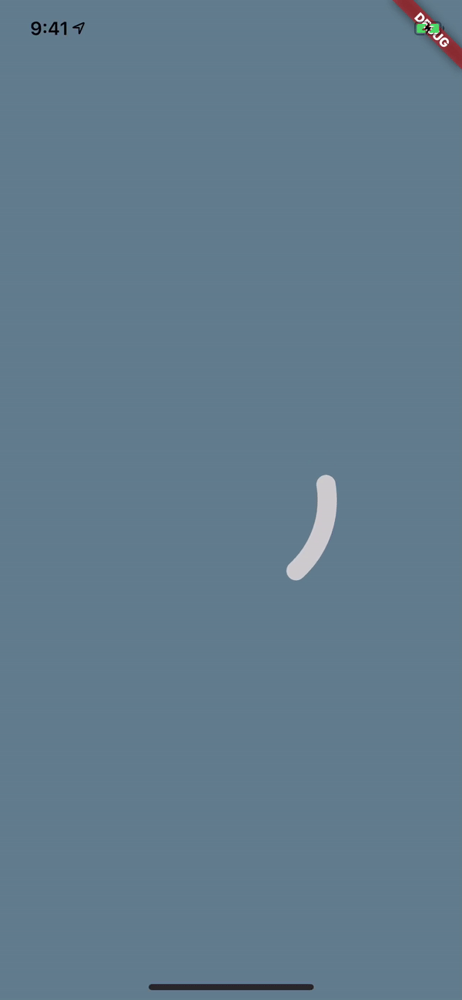

# Flare Loading Indicator

An example of how to use a Flare controller to drive a loading animation. It waits for some condition to complete and chains a completion animation. The loading animation cycle completes after the dependent condition ensuring the completion animation plays only once the loading animation is complete.

Requested from this issue:
https://github.com/2d-inc/Flare-Flutter/issues/62

# Widget and Controller
Located here:
https://github.com/luigi-rosso/sequenced_loader/blob/master/lib/flare_progress_indicator.dart

# Flare File
You can fork the file here:
https://www.2dimensions.com/a/castor/files/flare/sequencedloader
